<h1 align="center">Facundo Chacón</h1>
<h3 align="center">Desarrollador Java / Full Stack Jr</h3>

  Estudiante avanzado de la Tecnicatura Superior Universitaria en Programación (UTN FRM),
  enfocado en desarrollo Full Stack, automatización de scripts y bases de datos relacionales.

  
  

Sobre mí

🎓 Estudiante avanzado de Programación en la UTN FRM.
💻 Trabajo principalmente con Java + Spring Boot en el backend, y React + Tailwind CSS en el frontend.
🗃️ Diseño y administro bases de datos relacionales con MySQL.
🐍 Uso Python para automatización de scripts y R para procesamiento estadístico de datos.
🤝 Habituado a trabajar bajo metodologías ágiles (Scrum), con Code Review y control de versiones en Git.
📍 Maipú, Mendoza, Argentina — disponibilidad de reubicación.

Stack tecnológico

  
  
  
  
  
  
  
  
  
  
  

Proyectos destacados

<table>
  <tr>
    <td width="50%">
      <h4><a href="https://github.com/FacundoChacon/CIMMA-DENTISTRY">CIMMA-DENTISTRY</a></h4>
      
Landing page profesional para un centro odontológico en Maipú, Mendoza. Pensada para captación de pacientes y contacto directo.

      
      
    </td>
    <td width="50%">
      <h4><a href="https://github.com/FacundoChacon/Bodega">Bodega</a></h4>
      
Aplicación Full Stack con backend en Java/Spring Boot, frontend en JavaScript y persistencia en base de datos relacional.

      
      
    </td>
  </tr>
  <tr>
    <td width="100%" colspan="2">
      <h4><a href="https://github.com/FacundoChacon/Tienda-Electronica">Tienda-Electronica</a></h4>
      
E-commerce de productos electrónicos con carrito de compras, panel de administración y autenticación JWT. Backend con Java/Spring Boot, frontend con React + Tailwind, base de datos MySQL.

      
      
      
      
      
    </td>
  </tr>
</table>
Estadísticas de GitHub

<!--
  Estas dos tarjetas son archivos SVG generados automaticamente por un workflow
  de GitHub Actions (ver .github/workflows/update-readme-stats.yml), que corre
  una vez al dia y las commitea a la carpeta /profile de este mismo repo.
  Esto evita depender del servicio publico de Vercel (github-readme-stats.vercel.app),
  que es gratuito pero inestable y puede sufrir caidas o rate-limiting sin aviso.
-->

  
  

  

  

